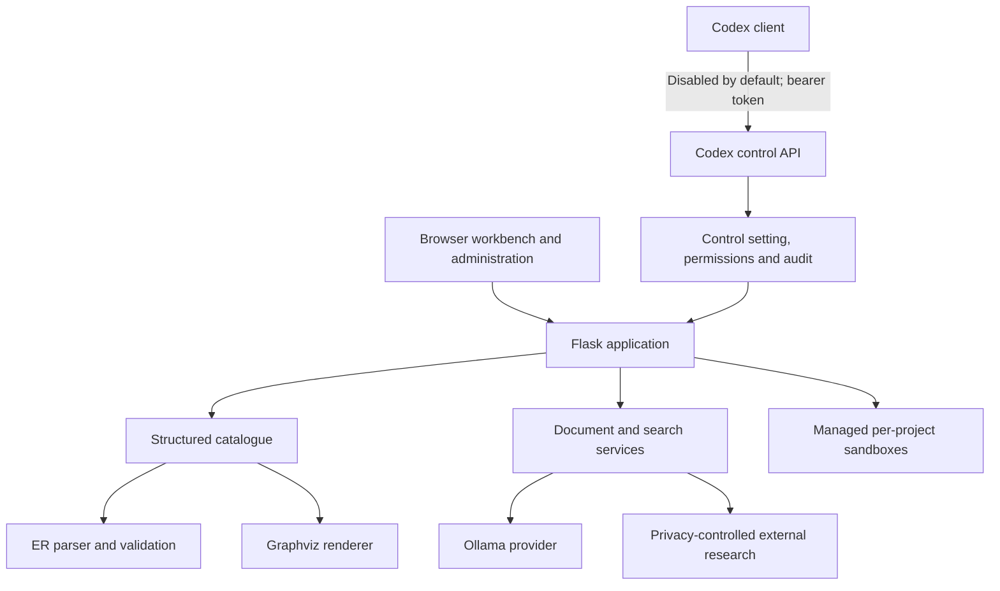

# System Knowledge Designer — overall design

## Product authority

The structured catalogue defines the schema. Documents explain business meaning. Sample data demonstrates behaviour. Deterministic services validate and execute SQL. Search retrieves evidence. The LLM organises, explains and proposes changes. A user approves material changes.

## System architecture

External research is a separately enabled evidence channel. The application first creates a local proposed job containing the original question and a deterministic, bounded generic query. Only a distinct user confirmation sends that displayed query to the fixed Wikipedia provider. Status, errors and bounded citations are persisted; failures retain a local-only knowledge-search route. External results are never silently indexed or sent to Ollama. A second, per-citation user action can promote a selected bounded result into provenance-labelled local knowledge through the normal managed-file and FTS services.

## Codex control and inspection API

The application includes a versioned API at `/api/codex/v1` so Codex can inspect and operate the application through the same deterministic service boundaries as the browser. It is an administrative integration, not arbitrary code execution.

Security and governance:

- Disabled by default and switchable under **Control Settings**.
- Requires `CODEX_CONTROL_TOKEN` and an `Authorization: Bearer …` header.
- A missing token prevents the administrator from enabling the API.
- API state is stored in the catalogue; the token is environment-only and never displayed or stored in normal settings.
- Every write is audited as a Codex API action.
- No shell, filesystem path, SQLAlchemy session, arbitrary SQL, database credential, or production database access is exposed.
- ER source always passes the grammar and semantic validator.
- Codex may create draft revisions but cannot approve them through the API. Approval remains an authenticated browser confirmation.
- Disabling the control setting immediately blocks all API capabilities without requiring a restart.

Initial API capabilities:

| Method | Endpoint | Classification |
|---|---|---|
| `GET` | `/status` | Inspect API state/capabilities |
| `GET` | `/projects` | Inspect project summary |
| `GET` | `/projects/{id}` | Inspect project and revision metadata |
| `POST` | `/validate` | Deterministically validate ER source |
| `POST` | `/projects` | Create an audited project |
| `POST` | `/projects/{id}/revisions` | Create an audited draft revision |

Future control endpoints must be typed, versioned, permission-classified, audited, idempotent where appropriate, and explicit about confirmation. Sandbox rebuilds, SQL execution, document linking, and AI actions must use their domain services; the API must never implement a parallel bypass.

## Storage boundaries

The catalogue database stores users, settings, projects, model revisions, structured schema objects, knowledge metadata, job/audit history and future evidence records. Each project sandbox uses an application-generated path. Documents and derived render artefacts live beneath managed project directories. Secrets stay in the environment.

## Delivery sequence

Phase 0 architecture → Phase 1 executable ER model → Phase 2 catalogue/repository and administrative control → Phase 3 sandbox/SQL → Phase 4 knowledge/search → Phase 5 grounded assistant/tools → Phase 6 external research → Phase 7 cross-project systems → Phase 8 hardening and scale.

## Documentation products

The application delivery includes two maintained documentation products. They are part of the acceptance criteria, not optional handover notes.

### System Knowledge Designer user manual

Build a task-oriented manual covering:

- Installation, configuration, first launch and secure login.
- Project creation, subject areas, schemas and catalogue navigation.
- ER Workbench editing, validation, preview, zoom, scrolling and export.
- Draft, approved and inactive revisions; comparison and restoration.
- Sample datasets, validation and sandbox materialisation.
- Safe SQL proposal, validation, execution, results and diagram highlighting.
- Document upload, extraction, search, evidence and citations.
- Assistant behavior, proposed actions and confirmation boundaries.
- Cross-project links and approved cross-project queries.
- Control Settings and the Codex control API.
- Administration, jobs, audits, backup, restore, troubleshooting and deployment.
- A complete demonstration walkthrough using the procurement fixture.

The manual source lives under `docs/manual/`, uses screenshots from the current application where useful, and identifies the application version it documents. Every completed phase must update affected manual sections. Launch and demonstration instructions must be tested on a clean local configuration before a release is accepted.

### ER language syntax reference

Build a versioned, normative `.erd` language reference covering:

- Lexical rules, identifiers, quoted strings, numbers, whitespace and comments.
- Model, dialect and layout declarations.
- Subject areas, schemas, tables, views and fields.
- Types, length, precision, scale, defaults, nullability and computed fields.
- Primary, foreign, unique and composite keys.
- Constraints, indexes, descriptions, aliases, tags, notes and style hints.
- Local and cross-project relationships, composite field pairs, cardinality, optionality and update/delete behavior.
- Includes, path rules, circular-include detection and layout hints.
- Complete grammar, syntax diagrams or equivalent production descriptions.
- Valid examples, invalid examples, diagnostic messages and suggested corrections.
- Mermaid ER import compatibility and documented non-round-trippable features.
- Grammar-version compatibility and deprecation policy.

The syntax reference source lives under `docs/er-language/`. Executable examples must also exist as parser fixtures, and the documentation build must validate every example against the current grammar. The parser grammar and typed intermediate model remain authoritative; prose may explain them but must not silently define unsupported syntax.

### Documentation build and release controls

- Author documentation in reviewable Markdown and optionally publish HTML/PDF from the same source.
- Keep generated output outside the authoritative source directories.
- Validate internal links, code examples and documented commands in CI.
- Record screenshots and expected UI labels against a specific application version.
- Add documentation changes to each phase handover.
- A first usable release is not complete until both documents cover every delivered workflow and their automated checks pass.

## AI-assisted sample record generation

The Sample Data area includes a dedicated table-first LLM workspace adapted from Tender Designer's assistant/action pattern. Its left navigation lists model tables instead of chat sessions. Selecting a table provides bounded schema context to a local Ollama model; the centre panel captures generation count/model/instructions, and the right panel displays proposed rows.

The LLM never writes sample rows directly. Output must be structured JSON, match the requested count and pass deterministic table/field/type/nullability/length validation. A persisted `AIAction` records the proposal. The user explicitly confirms or rejects it; confirmation revalidates against the still-active model revision before rows are appended and audited. Model or dataset drift invalidates the proposal.
